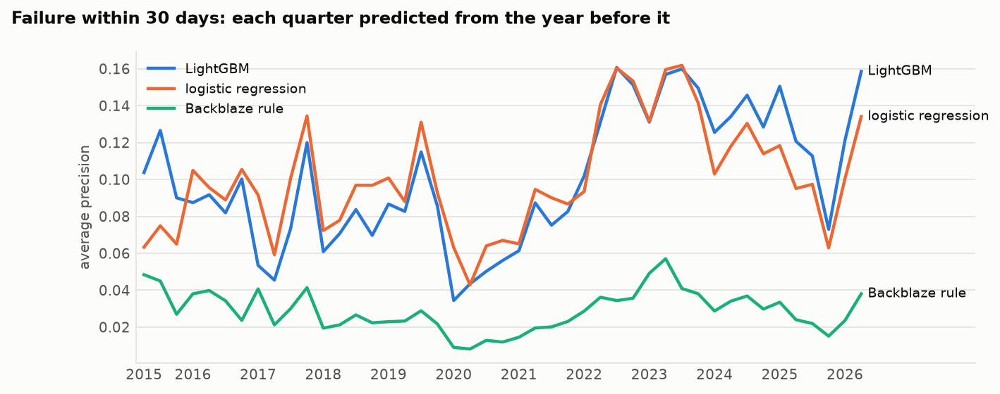
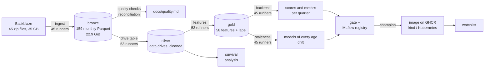
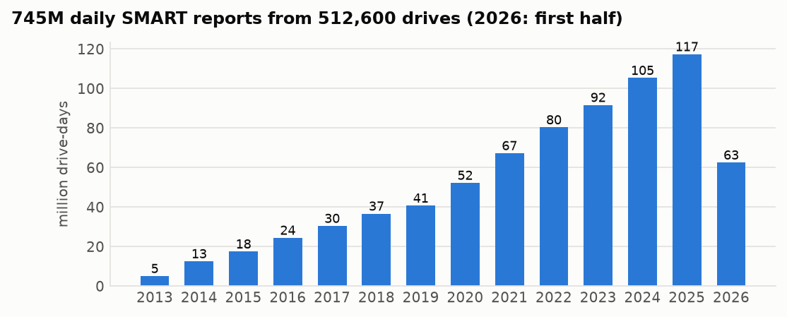
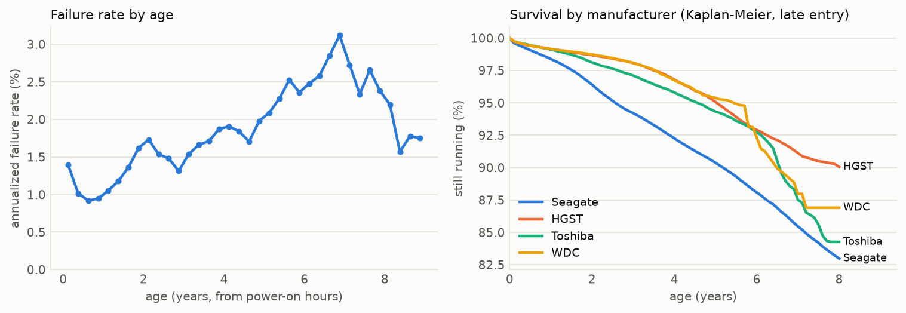
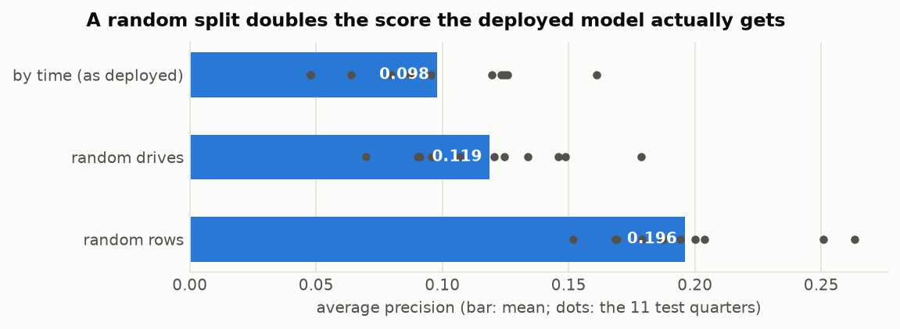
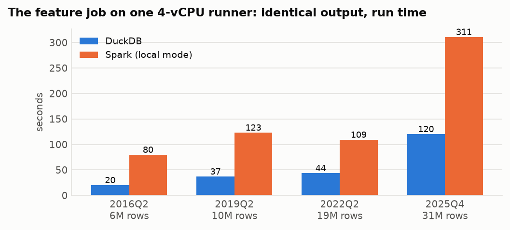
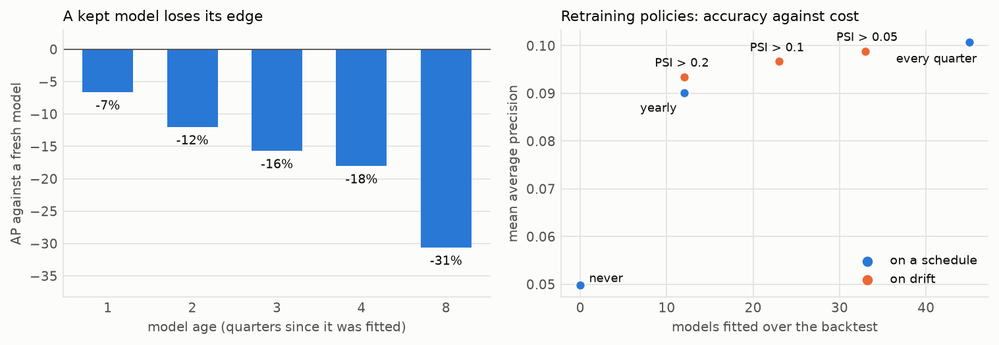
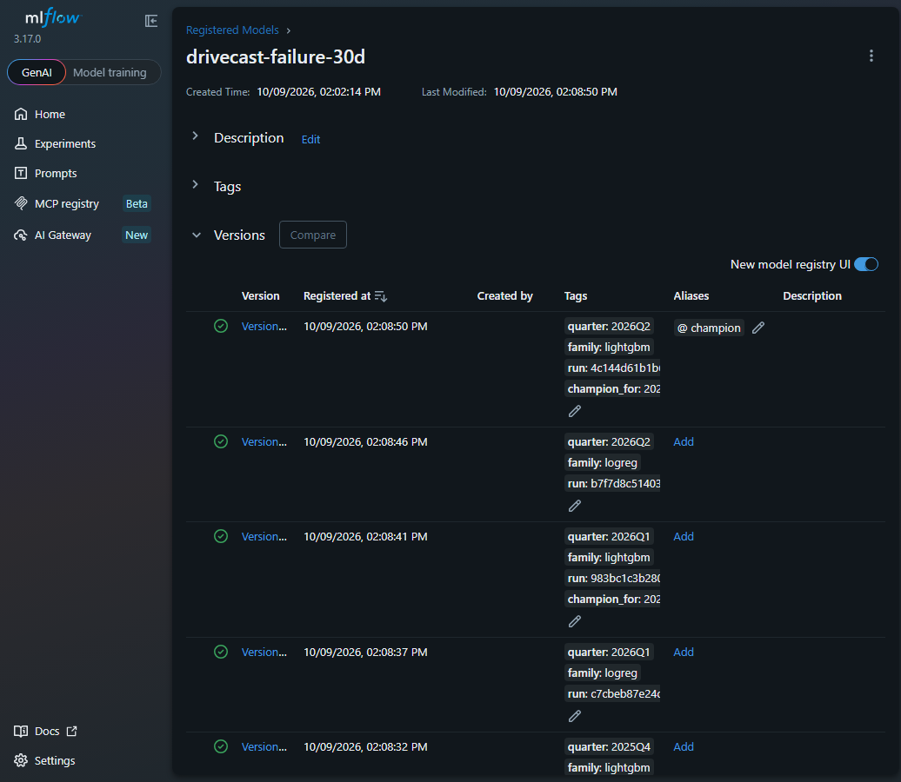

# drivecast

[](https://github.com/GBR-RL/drivecast/actions/workflows/ci.yml)
[](https://github.com/GBR-RL/drivecast/actions/workflows/deploy.yml)
[](https://github.com/GBR-RL/drivecast/actions/workflows/refresh.yml)

Which hard drives will fail in the next 30 days? drivecast is a data and MLOps pipeline built
on a decade of daily SMART reports from the Backblaze fleet: **744.5M rows from 512,600 drives**.
It covers the whole path:

1. Ingest the published files into a Parquet lake, then validate it and reconcile it with
   Backblaze's own published numbers.
2. Build features, then backtest models quarter by quarter over 11 years.
3. Measure how fast a deployed model decays, and choose when to retrain.
4. Register the models in MLflow.
5. Serve the champion behind an HTTP API on Kubernetes.
6. Re-run the chain automatically when Backblaze publishes a new quarter.

Every stage runs as a matrix of jobs (up to 53, 20 at a time) on free GitHub runners. The data lives
as Parquet assets of GitHub releases, which DuckDB queries in place over HTTP.

<picture>
  <source media="(prefers-color-scheme: dark)" srcset="docs/assets/backtest-dark.png">
  
</picture>

## Pipeline



| stage | what it does | runs as |
|---|---|---|
| [ingest](.github/workflows/ingest.yml) | stream each zip into monthly Parquet in one schema (85 to 197 columns over the years), count every value that fails to cast | 45 jobs → release `lake-v1` |
| [quality](.github/workflows/quality.yml) | 18 checks per year, reconciliation with the published quarterly numbers | 1 job, month by month |
| [silver](.github/workflows/silver.yml) | drive table, then per quarter: data drives only, duplicates collapsed, rows after a failure removed | 1 + 53 jobs → `silver-v1` |
| [features](.github/workflows/features.yml) | per drive and day: counters, their 7- and 30-day growth, age, temperature, manufacturer; label "fails within 30 days" | 53 jobs → `gold-v1` |
| [backtest](.github/workflows/backtest.yml) | every quarter from 2015Q2 predicted by models fitted on the four quarters before | 45 jobs → `backtest-v1` |
| [staleness](.github/workflows/staleness.yml) | each quarter scored by models 0–8 quarters old, with their drift | 45 jobs → `mlops-v1` |
| [MLOps](.github/workflows/mlops.yml) | retraining policies, champion/challenger gate, MLflow store | 3 jobs |
| [deploy](.github/workflows/deploy.yml) | image with the champion, kind cluster, smoke and load test, push to GHCR | 1 job |
| [refresh](.github/workflows/refresh.yml) | weekly: if Backblaze published a new quarter, all of the above for it | reusable workflows |

One full pass of ingest, silver, features, backtest and staleness takes about 1,170
runner-minutes but about 1.5 hours of wall time. The longest single stage is staleness: 696
runner-minutes, finished in 49 minutes on 20 parallel runners.

Two rules shaped the design:

- **No single query over the whole lake.** One aggregation over all 744M rows lost a 16 GB
  runner to memory, so the drive table and the quality checks work one month at a time. On the
  2013 data they give the same results as the single query.
- **No training/serving skew by construction.** The service turns a request's raw readings into
  features with the same SQL that built the training data, and a test checks that every feature
  matches.

## Data quality

`drivecast quality` counts every problem and fixes none in bronze; the silver layer applies one
documented rule per problem. The full report is in [docs/quality.md](docs/quality.md).

- **Reconciliation.** Applying each quarter's published inclusion rule to the lake reproduces
  Backblaze's fleet counts **exactly** for 2022Q3, 2025Q2 and 2026Q1, and the AFR to within 0.02
  points. 2026Q1 failures match exactly, and 2026Q2 drive days match exactly (31,553,350).
- **Spreadsheet damage.** Two published daily files (2018-02-25 and 2019-06-17) were saved
  through a spreadsheet: dates written as `2/25/18` and numbers like `4.00079E+12`. The ingest
  takes each row's date from its file name and counts the damaged rows.
- **Other findings:**
  - an eight-week gap in 2013, with as few as 315 reports a day against 24,000 drives alive;
  - 235,623 duplicate rows, all in 2022;
  - 1,212 drives that keep reporting after their failure;
  - 105,725 drives whose power-on hours go down;
  - 12.2M rows from boot drives and SSDs, which Backblaze also excludes.

<picture>
  <source media="(prefers-color-scheme: dark)" srcset="docs/assets/lake-dark.png">
  
</picture>

## How long drives live

Survival analysis of 505,182 data drives and 31,941 failures. Age is taken from power-on hours,
so a drive already in service when first seen enters the analysis at its age then (late entry).
Ignoring that inflates survival, although only slightly in this fleet, where most drives are
watched from new.

<picture>
  <source media="(prefers-color-scheme: dark)" srcset="docs/assets/survival-dark.png">
  
</picture>

| manufacturer | drives | drive years | AFR | 95% interval |
|---|---:|---:|---:|---|
| Seagate | 211,084 | 990,813 | 2.11% | 2.08–2.14 |
| HGST | 68,377 | 390,328 | 1.18% | 1.15–1.21 |
| Toshiba | 129,883 | 416,661 | 1.13% | 1.10–1.17 |
| WDC | 95,819 | 229,274 | 0.74% | 0.70–0.77 |

A Cox model (late entry, 100,000 sampled drives) gives hazard ratios against Seagate of
0.53 for HGST, 0.53 for WDC and 0.77 for Toshiba. Each later cohort year has 0.82 times the
hazard. The worst model in the data is the ST3000DM001, at 25% AFR.

## Predicting failures

Each test quarter from 2015Q2 to 2026Q2 is predicted by models fitted on the four quarters
before it. Training rows from the last 30 days before the test quarter are dropped, because
their labels look into it. Every drive and day of the test quarter is then scored (28,743
failing drives in total).

| model | mean AP | ROC AUC | precision, top 25/day | recall, top 25/day | recall at 1% false alarms |
|---|---:|---:|---:|---:|---:|
| Backblaze's rule (SMART 5, 187, 188, 197, 198 > 0) | 0.029 | 0.76 | 0.14 | 0.07 | 0.40 |
| logistic regression | 0.101 | 0.82 | 0.40 | 0.25 | 0.58 |
| LightGBM | 0.101 | 0.83 | 0.37 | 0.23 | 0.58 |

- **Learned models against the rule.** Both learned models beat the rule in all 45 quarters.
- **LightGBM against logistic regression.** LightGBM does not beat a well-prepared logistic
  regression overall (it is behind in 28 of 45 quarters), but it is ahead from 2024 onwards.
- **What is achievable.** About 0.15% of drive-days precede a failure, and the median warning
  comes 4–6 days ahead. Honest numbers are far from the 90%+ detection rates sometimes quoted.

**Leakage.** The same model scored with a random split of rows, the common mistake, reports
twice the average precision it achieves when deployed (0.196 against 0.098). The reason: a
drive's neighbouring days, and its future, end up in training.

<picture>
  <source media="(prefers-color-scheme: dark)" srcset="docs/assets/leakage-dark.png">
  
</picture>

**Sequence model.** A GRU reading each drive's raw last 30 days (12 SMART counters, temperature,
hours, a reported-that-day mask) was compared with the per-day models on weekly checks of every
drive, in the second quarter of each year from 2016 to 2026:

| model | mean AP | recall at 1% false alarms |
|---|---:|---:|
| LightGBM | 0.100 | 0.49 |
| logistic regression | 0.097 | 0.48 |
| GRU | 0.090 | 0.49 |

The GRU is ahead in only 3 of 11 quarters: the 7- and 30-day growth features already carry
what the raw sequence adds. 2015Q2 was used to settle its class weighting and is not counted.

**Engines.** The feature job also exists in Apache Spark. On four quarters (65M rows) both
engines produce identical output, with 0 differing values in 61 columns. On one 4-vCPU runner,
DuckDB is 2.5–4 times faster. Spark's case is a cluster, which this does not test.

<picture>
  <source media="(prefers-color-scheme: dark)" srcset="docs/assets/engines-dark.png">
  
</picture>

## Operating the model

A model is only as good as the data it was fitted on, and the fleet keeps changing: new drive
models arrive every year and old ones are retired. To measure the cost of keeping a model,
every test quarter was also scored by the models deployed 1, 2, 3, 4 and 8 quarters earlier,
and by one model frozen in 2015 (`staleness`, 45 runners).

<picture>
  <source media="(prefers-color-scheme: dark)" srcset="docs/assets/staleness-dark.png">
  
</picture>

| retraining policy | models fitted | mean AP | recall, top 25/day |
|---|---:|---:|---:|
| never (the 2015 model) | 0 | 0.050 | 0.18 |
| yearly | 12 | 0.090 | 0.21 |
| when drift (PSI of the top 10 features) > 0.2 | 12 | 0.094 | 0.24 |
| when drift > 0.1 | 23 | 0.097 | 0.23 |
| every quarter | 45 | 0.101 | 0.23 |

- **Decay.** A kept model loses 7% of its average precision after one quarter and 31% after
  two years. The 2015 model, never retrained, ends up at half the AP of a fresh one.
- **Retraining on drift.** At the same cost as a yearly schedule (12 models), retraining when
  drift crosses 0.2 gives a mean AP of 0.094 against 0.090, and the best daily recall of all
  the policies (0.24).
- **What predicts the decay.** Drift predicts it (Spearman −0.35 over 207 model-quarter pairs),
  but the model's plain age predicts it better (−0.48). Drift on the input features misses
  what changes most here: which drives fail and why.

**Champion and challenger.** Each quarter, a fresh logistic regression and a fresh LightGBM
compete. The challenger replaces the champion only if it was at least 5% better on the quarter
that just ended. That comparison uses only rows whose labels are already known on the decision
day, scored by models fitted on even earlier data.

| deployment rule | mean AP over 45 quarters |
|---|---:|
| always LightGBM | 0.1007 |
| always logistic regression | 0.1006 |
| the gate (6 promotions) | **0.1067** |
| oracle (the better model each quarter, known in advance) | 0.1080 |

The gate closes 82% of the gap between always deploying one model and the oracle, using no
information from the future. LightGBM has been champion since 2024Q1.

**MLflow.** Every backtest run is in an MLflow store, with its parameters, metrics and feature
importance. Each quarter's fitted models are registered as versions of `drivecast-failure-30d`,
and a `champion` alias follows the gate quarter by quarter. The store is published with the
[MLOps release](https://github.com/GBR-RL/drivecast/releases/tag/mlops-v1):

```bash
gh release download mlops-v1 --repo GBR-RL/drivecast --pattern mlflow-store.tar.gz
tar xzf mlflow-store.tar.gz
mlflow server --backend-store-uri sqlite:///mlflow/mlflow.db --artifacts-destination mlflow/artifacts
```

The registry holds 135 runs and 90 model versions; the `champion` alias points to version 90,
the LightGBM model fitted for 2026Q2. The deploy workflow resolves the alias and bakes that
model into the image.



## Serving

The image (`ghcr.io/gbr-rl/drivecast`) carries the model that the registry's `champion` alias
points to, resolved at build time, so the container needs no MLflow:

```bash
docker run -p 8000:8000 ghcr.io/gbr-rl/drivecast:latest
curl localhost:8000/health
curl -X POST localhost:8000/score -H 'content-type: application/json' -d '{
  "drives": [{"serial_number": "ZL2ABC01", "model": "ST16000NM001G",
              "capacity_bytes": 16000900661248,
              "readings": [{"date": "2026-06-29", "smart_5_raw": 8, "smart_9_raw": 21000},
                           {"date": "2026-06-30", "smart_5_raw": 24, "smart_9_raw": 21024}]}]}'
```

The response gives each drive's score for its last day, the features the pipeline's SQL
computed from its readings, and which of Backblaze's five warning attributes are above zero.

`deploy/k8s` holds:
- a two-replica deployment with probes, resource limits, a read-only root filesystem and no
  Linux capabilities;
- a service, a CPU autoscaler (2–6 replicas) and a disruption budget.

On every change, CI deploys the image to a kind cluster and sends it 300 concurrent requests of
10 drives × 30 days each. With the current champion, 2 pods answered at **p50 148 ms, p95 266
ms, 50 requests/s (499 drives/s), with no errors**. Runs vary with the runner; the first one
measured p50 291 ms.

The [watchlist](https://github.com/GBR-RL/drivecast/releases/tag/watchlist) scores every data
drive on the latest day of the published data (351,179 drives on 2026-06-30) and lists the 100
riskiest. 30,393 drives had a SMART warning that day; the model's own expectation is about 714
failures in the next 30 days.

## Running it

```bash
uv venv && uv pip install -e ".[dev,models,survival,mlops,serve]"
drivecast ingest 2013 --out data/lake/bronze      # one published file into the lake
drivecast quality --lake release:lake-v1          # checks over the published lake, in place
drivecast drives --lake data/lake/bronze && drivecast silver 2013Q4
drivecast features 2013Q4 && drivecast backtest 2015Q2 --gold data/lake/gold
```

The full runs are the workflows above, all started by hand (`workflow_dispatch`) except the
weekly refresh. Each stage reads the previous stage's release, so any stage can be re-run alone.

## Data, licence and limitations

Data: [Backblaze Drive Stats](https://www.backblaze.com/cloud-storage/resources/hard-drive-test-data),
© Backblaze, free to use with attribution. The derived lake in this repository's releases is
not for sale, under the same terms. Code: MIT.

- **One fleet.** The data comes from a single operator's fleet, with its own drive models,
  workloads and replacement practice. Results do not transfer to other fleets without checking.
- **What "failure" means.** A failure is Backblaze's operational label (the drive was removed for
  failing or about to fail), not a physical diagnosis. Some drives are recorded as failed and then
  keep reporting.
- **SMART attributes differ by vendor.** The models see manufacturer flags, but a new vendor or
  firmware can change what a raw value means.
- **The probabilities are only roughly calibrated.** In the backtest they sum to about 0.9 of the
  actual positives. The watchlist's expected count is the model's own estimate, not a forecast.
- **The engine comparison is single-node.** It says nothing about Spark on a cluster.
